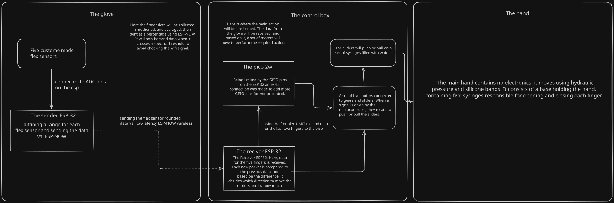
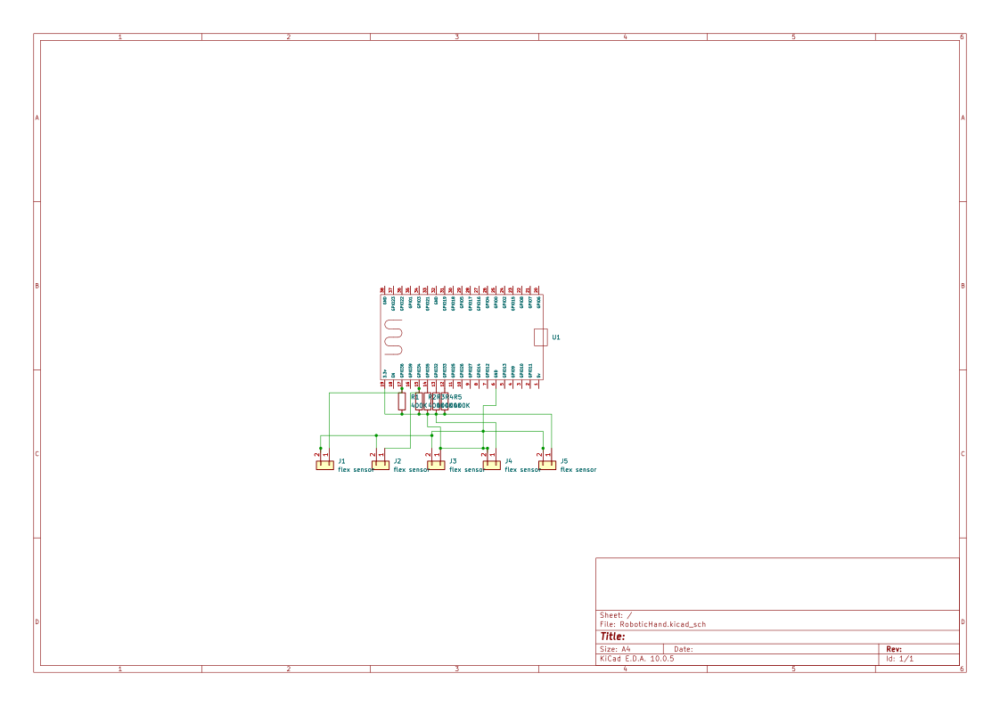

# Hydraulic Arm

*A robotic arm that can move using hydraulics, and a glove that will send the movement to the arm to mimic or control it.*

:::info 

**Author**: Al Waely Abdulrahman \
**GitHub Project Link**: https://github.com/UPB-PMRust-Students/fils-project-2026-CRISISXx/tree/main

:::

## Description

*Basically my project is a robotic arm that can move using hydraulics. Most of the pieces will be 3D printed, using syringes filled with water and small flexible tubes. We can increase the pressure in the tubes making them stiffen, and using silicone bands we can simulate a reverse motion. The syringes will be pressed using stepper motors.*

## Motivation

*My motivation for this project is to help those who have physical limitations and have lost the ability to perform simple day-to-day tasks. I don't plan on making a super precise and expensive factory production robotic arm rather I am focusing on making a cheaper desk arm that can do simple tasks such as helping an amputee put on a watch, put on a jacket, or hold down the paper as they write. Furthermore I believe that in most task that requires automation it isn't needed a full robot that can walk and that looks like a human with an expensive parts, what is actually needed or the part that is most used or the majority of those tasks is just the hand any other part could be basically any shape as long as it can perform a simple motion for some tasks.*

## Architecture

## Log

### Week 3 - March 11

*At this stage, I started to think of my project idea and how it would work and the parts I needed for it to work. Basically at this period was the planning phase.*

### Week 6 - April 1

*During this period, I decided on most of the parts that I needed were searching for the best place to get all of them from. And waiting for the project idea feedback*

### Week 7 - April 8

*I ordered most of the parts that I need such as the cables, stepper motors, MPU6050, and more.*

### Week 7 - April 10

*I decided on the 3D modeling software that I will use and started to watch tutorials and get used to the layout and for the following days I started to make the first set of designs.*

### Week 9 April 23

*At this time I had received the ordered parts and I started testing and using them so far I could not go far in the 3D model as I needed to take measurements for the parts that I had to use and I still needed more of the orders to arrive.*

### Week 10 May 1

**

## Hardware
The project used two ESP32 38 pins to send data wirelessly via ESP-NOW, pico 2W for more GPIO pins to control the motors, five stepper motors to control each finger movement, and a DIY flex sensor to detect each finger's movement.

## Schematics

## Bill of Materials

| Device | Usage | Price |
|--------|--------|-------|
| [Raspberry Pi Pico 2W](https://www.raspberrypi.com/documentation/microcontrollers/pico-series.html#pico2) | The microcontroller | [39.66 RON](https://www.optimusdigital.ro/en/raspberry-pi-boards/13327-raspberry-pi-pico-2-w.html) |
| [Plusivo ESP32 and BLE Compatible Wireless Development Board x2](https://www.raspberrypi.com/documentation/microcontrollers/pico-series.html#pico2) | The microcontroller | [60 RON](https://www.optimusdigital.ro/en/esp32-boards/12933-plusivo-esp32-and-ble-compatible-wireless-development-board.html) |
| [28BYJ48 stepper motor module and ULN2003 driver x5](https://www.mouser.com/datasheet/2/758/stepd-01-data-sheet-1143075.pdf) | The microcontroller | [94.9 RON](https://www.bitmi.ro/module-electronice/modul-motor-pas-cu-pas-28byj48-si-driver-uln2003-10399.html) |

## Software

| Library | Description | Usage |
|---------|-------------|-------|
| [defmt_rtt & panic_probe](https://github.com/knurling-rs/defmt/blob/main/README.md) | RTT-based logging and panic handler | Used to stream debug log messages from the pico to the terminal |
| [defmt](https://github.com/knurling-rs/defmt/blob/main/README.md) | Deferred formatting logging framework | Used to provide low_overhead logging macros for terminal diagnostics |
| [embassy_executor](https://github.com/embassy-rs/embassy) | Asynchronous task execution engine | Used to manage and run async tasks on the microcontroller |
| [embassy_rp](https://github.com/embassy-rs/embassy) | Hardware peripheral access library for raspberry pi pico | Used to initialize hardware peripherals, including GPIO pins and UART serial communication |
| [embassy_time](https://github.com/embassy-rs/embassy) | Asynchronous time managment library | Used to handele precise non-blocking delays between stepper motor steps |
| [serde](https://github.com/serde-rs/serde) | Framework for serializing and deserializing data structures | Used alongside postcard to translate custom finger coordinate structs into raw bytes from transmission |
| [nb](https://github.com/rust-embedded/nb) | Non-blocking I/O abstraction wrapper | Used to block on non-blocking operations like ADC conversions |

